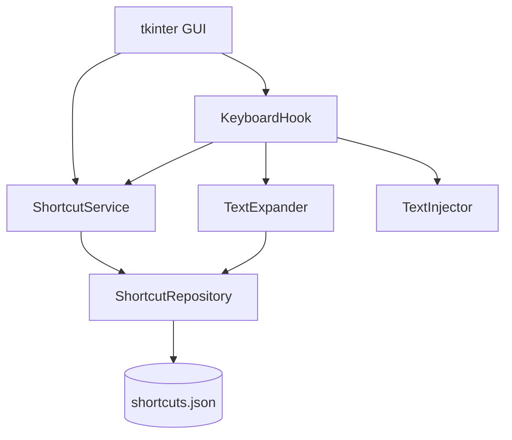

# System Patterns

## 아키텍처 개요

**단일 패키지 + 레이어 분리**. GUI와 전역 확장 서비스가 동일한 Service·Repository를 공유합니다.

```
단축어 프로그램/
├── main.py                     # 진입점 → GUI 실행 + 백그라운드 Expander 시작
├── src/
│   ├── models.py               # Shortcut 데이터 모델
│   ├── repository.py           # JSON load/save
│   ├── service.py              # CRUD + 검증
│   ├── expander.py             # suffix 매칭·치환 로직 (순수 함수)
│   ├── keyboard_hook.py        # pynput 전역 리스ner, 입력 버퍼 관리
│   ├── injector.py             # 백스페이스 + expansion 타이핑/붙여넣기
│   └── gui/
│       ├── app.py              # tkinter 메인 Application
│       ├── main_window.py      # 목록·편집·서비스 ON/OFF
│       └── widgets.py          # (선택) 재사용 위젯
├── data/
│   └── shortcuts.json          # 사용자 매핑 (gitignore)
├── requirements.txt
└── README.md
```

## 컴포넌트 관계



## 핵심 도메인 개념

| 개념 | 설명 |
|------|------|
| **Trigger** | 사용자가 자유롭게 등록하는 짧은 문자열 (예: `addr`, `회사서명`, `myemail`) |
| **Expansion** | 트리거에 대응하는 치환 결과 (단어 또는 여러 줄) |
| **Shortcut** | Trigger + Expansion 쌍 |
| **InputBuffer** | 전역 후킹 시 최근 입력 문자열 (suffix 매칭용, 최대 길이 제한) |

> **Prefix(접두사) 규칙은 사용하지 않음** — 트리거 형식에 제한 없음.

## 설계 패턴

### Repository 패턴

- `ShortcutRepository`: `shortcuts.json` ↔ `dict[str, str]` 변환
- GUI 저장·후킹 reload 모두 동일 Repository 경유

### Service 레이어

- `ShortcutService`: add / update / remove / list / get_all
- 트리거 중복·빈 값 검증
- 변경 시 Repository 저장 + (선택) 후킹 캐시 갱신 콜백

### Expander (치환 엔진)

- 순수 함수: `(buffer: str, shortcuts: dict) -> expansion | None`
- 버퍼 **끝(suffix)** 이 등록 트리거와 일치하면 expansion 반환
- 복수 매칭 시 **가장 긴 트리거** 우선

### KeyboardHook + TextInjector

- **KeyboardHook**: `pynput`으로 키 이벤트 수신, InputBuffer 갱신, Expander 호출
- **TextInjector**: 매칭 시 트리거 길이만큼 `Backspace` 후 expansion 입력
  - 짧은 텍스트: `keyboard.Controller.type`
  - 줄바꿈·긴 텍스트: 클립보드 붙여넣기 (`pyperclip`) 검토

### GUI (tkinter)

- `MainWindow`: Treeview 또는 Listbox로 단축어 목록
- 추가/수정 다이얼로그: Trigger Entry, Expansion Text 위젯
- **서비스 상태**: 후킹 활성/비활성 토글, 상태바 표시
- Service 변경 → 즉시 JSON 저장 + Hook에 shortcuts reload

## 트리거 매칭 정책

1. InputBuffer 끝이 등록된 트리거와 **완전 일치**할 때 확장
2. 여러 트리거 매칭 → **가장 긴 트리거** 우선
3. 확장 트리거: **Space**, **Enter**, **Tab**, 또는 **구두점** 입력 시점에 검사 (오입력 방지)
4. InputBuffer 최대 길이: 등록된 최장 트리거 + 여유 (예: 256자)

## 실행 흐름

```
main.py
  ├─ ShortcutRepository.load()
  ├─ ShortcutService 초기화
  ├─ KeyboardHook 시작 (별도 스레드)
  └─ tkinter MainWindow.mainloop()
       ├─ CRUD → Service → JSON 저장 → Hook.reload()
       └─ 종료 시 Hook.stop()
```

## 데이터 형식

```json
{
  "version": 1,
  "shortcuts": {
    "addr": "서울특별시 강남구 ...",
    "회사서명": "감사합니다.\n홍길동",
    "myemail": "user@example.com"
  }
}
```

## 스레드·동시성

- **pynput 리스ner**: 별도 스레드 (GUI mainloop와 분리)
- **GUI → Service**: main thread에서 CRUD
- **Hook.reload()**: thread-safe하게 shortcuts dict 교체 (lock 또는 immutable snapshot)

## 확장 시 고려사항

- **자유 트리거 충돌**: 일반 단어 오치환 → GUI에 등록 시 경고 문구
- **IME(한글)**: 조합 완료(commit) 후에만 버퍼에 반영; 구현·테스트 필수
- **보안**: expansion에 민감 정보 → `data/` gitignore, 클립보드 사용 시 일시적 저장 주의

## 코딩 컨vention

- Python 3.10+
- 타입 힌트 사용
- 사용자-facing 메시지는 한국어
- GUI 문자열·오류 메시지는 `src/gui/` 또는 constants 모듈에 모음
